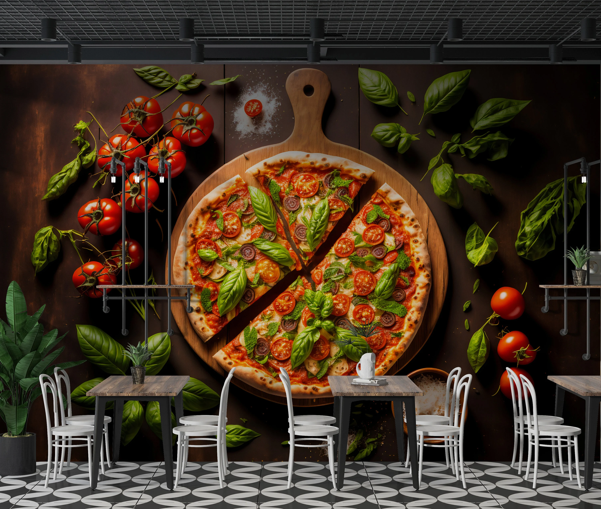
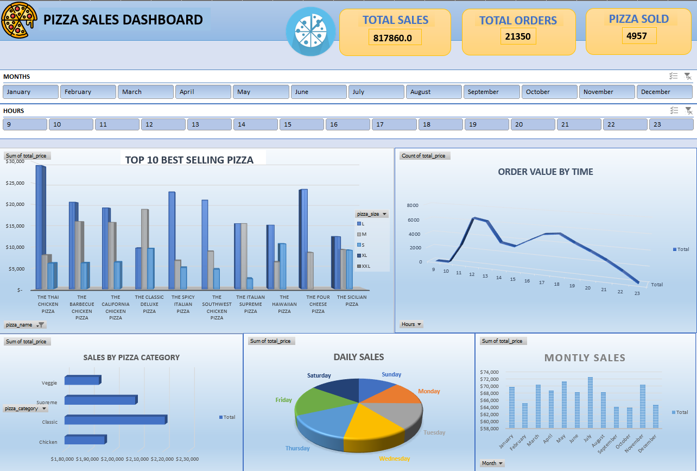

# PIZZA SALES DASHBOARD

## 📌 PROJECT OVERVIEW

This dashboard provides a comprehensive analysis of pizza sales to uncover key insights into customer preferences, sales trends, and operational improvements. By examining order patterns, ingredient usage, and high-value customers, the goal is to refine product offerings, enhance marketing strategies, and optimize overall business performance.

## ⚙️ TOOLS USED
 &nbsp;

 Microsoft Excel

## 🎯 PROJECT GOALS
- Identify the best-selling pizzas and customer preferences

- Analyze seasonal trends and peak ordering times

- Understand purchase behavior based on weekdays and time of day

- Optimize menu offerings based on ingredient usage data

- Recognize high-value customers for targeted promotions

# 📈 INSIGHTS
Key Insights from Project

### 1️⃣ Top-Selling Pizza  
- The Thai Chicken Pizza emerged as the best-selling item across all categories, reflecting strong customer demand for this flavor.  

### 2️⃣  Popular Categories  
- The *Classic* category dominated sales, followed by *Premium* pizzas, suggesting a preference for traditional flavors with some interest in premium options.  

### 3️⃣ Seasonal Trends 
- Sales peaked in July, May, and March, indicating higher demand during summer and spring, possibly due to holidays or special occasions.

### 4️⃣ Order Patterns 
- Peak Ordering Times:
  - Most orders were placed at 12 PM, 1 PM, and 6 PM, aligning with lunch and dinner hours.  
- Day of the Week Trends:
  - FRIDAYS recorded the highest sales, likely due to the start of the weekend and social gatherings.  
  - SUNDAYS had the lowest sales, possibly due to reduced dining out and a preference for home-cooked meals.

### 5️⃣ Ingredient Usage Analysis
- A deep dive into ingredient usage revealed that Garlic, Tomatoes, and Red Onions are the most frequently used ingredients.
- This insight helps in menu expansion by focusing on these key ingredients while introducing new pizza options that align with customer preferences.
 
### 6️⃣ High-Value Customer Analysis
- The analysis of Order IDs identified customers with large and frequent orders.
- These insights allow for personalized promotions and loyalty rewards to encourage repeat business from high-spending customers.

## 🧠 DATA STORY

The restaurant's sales data highlights clear customer preferences and purchasing behaviors. The dominance of The Thai Chicken Pizza suggests a strong inclination toward unique yet familiar flavors. The Classic category’s lead in sales demonstrates an ongoing demand for traditional flavors, while the *Premium* category’s performance indicates an openness to trying higher-end options.  

Seasonality plays a significant role, with noticeable spikes in July, May, and March, indicating a strategic opportunity to maximize sales through promotions and special offerings. Furthermore, sales are highly dependent on mealtime, as seen in peak orders around 12 PM, 1 PM, and 6 PM. Weekday analysis shows FRIDAYS as the best-performing day, suggesting that weekend dining trends start early, while SUNDAYS present an opportunity to boost sales through targeted marketing.

  
### 💡Recommendations
### 1️⃣ Product Strategy
   🍕 Maintain strong stock levels for best-selling pizzas, especially The Thai Chicken Pizza.
   
   🍕 Experiment with new pizza flavors inspired by top ingredients (Garlic, Tomatoes, Red Onions).

### 2️⃣ Marketing & Promotions
   🍕 Seasonal Promotions: Run targeted offers in July, May, and March to maximize peak demand.
   
   🍕 Time-Based Deals: Introduce lunch and dinner combo offers during peak hours.
   
   🍕 Friday Specials: Offer exclusive Friday discounts to leverage high weekend sales.

### 3️⃣ Customer Targeting & Retention
   🍕 Identify repeat high-value customers and offer exclusive discounts to maintain loyalty.
   
   🍕 Introduce personalized deals based on past purchase behavior to increase engagement.

### 4️⃣ Operational Efficiency
   🍕 Optimize inventory management based on ingredient usage trends to minimize waste.
   
   🍕 Improve delivery service speed during peak hours to enhance customer satisfaction.

## 📊 DASHBOARD

